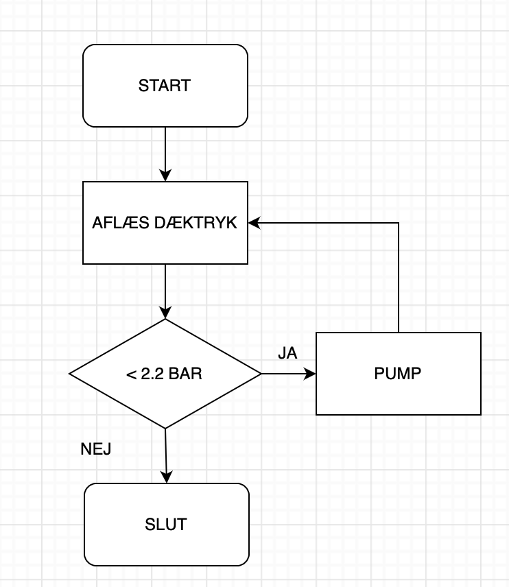

# Flowchart eller Rutediagram

Et flowchart eller rutediagram er en standardiseret grafisk repræsentation af rækkefølgen af ​​operationer. Det kan bruges til at lave modeller af processer og er centralt i process-optimering og strukturering.

Et flowchart har følgende elementer, start, hændelse, forgrening og slut og rækkefølgen vises med pile.
,

Selvom symbolerne er standardiserede kan der godt forekomme afvigelser, som her med ingeniørens ynglingsdiagram.

Jo dummere noget er jo mere præcise skal instruktionerne være. Her må vi sige at computere er meget dumme, men det kan mennesker nu også være, [peanutbuttersandwich](https://youtu.be/j-6N3bLgYyQ).

Her er et simpelt eksempel på logikken i en pumpe til bildæk.

Flowcharts kan laves i hånden men dette program virker også, [https://app.diagrams.net](https://app.diagrams.net).

### Øvelse
* Lav om i ovenstående rutediagram så pumpen også kan tage højde for at dæktrykket kan være for højt.

Rutediagrammer behøver ikke at være forbeholdt mekaniske processer eller programmeringsstrukturer. Det kan også være
* Folks bevægelse på en hjemmeside.
* Strukturering af tanker og beslutningsprocesser.
* Datastrømme.
* Arbejdsgangen ved løsning af matematikopgaver.
* Find selv på et par stykker.

## Billedmanipulation
### Øvelse
I forhold til billedmanipulation skal I udarbejde et rutediagram over brugerens interaktion med programmet. Lav en model for hvad brugeren ser, hvilke handlinger brugeren foretager og hvad slutresultatet er.
