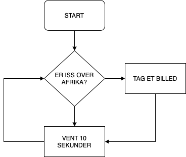

# Flowchart eller Rutediagram

Et flowchart eller rutediagram er en standardiseret grafisk repræsentation af rækkefølgen af ​​operationer. Det kan bruges til at lave modeller af processer og er centralt i process-optimering og strukturering.

Et flowchart har følgende elementer, start, hændelse, forgrening og slut og rækkefølgen vises med pile.
,

Selvom symbolerne er standardiserede kan der godt forekomme afvigelser, som her med ingeniørens ynglingsdiagram.

Jo dummere noget er jo mere præcise skal instruktionerne være. Her må vi sige at computere er meget dumme, men det kan mennesker nu også være, [peanutbuttersandwich](https://youtu.be/j-6N3bLgYyQ).

Her er et simpelt eksempel på logikken i en pumpe til bildæk.

Flowcharts kan laves i hånden men dette program virker også, [https://app.diagrams.net](https://app.diagrams.net).

### Øvelse
* Lav om i ovenstående rutediagram så pumpen også kan tage højde for at dæktrykket kan være for højt.

Rutediagrammer behøver ikke at være forbeholdt mekaniske processer eller programmeringsstrukturer. Det kan også være
* Folks bevægelse på en hjemmeside.
* Strukturering af tanker og beslutningsprocesser.
* Datastrømme.
* Arbejdsgangen ved løsning af matematikopgaver.
* Find selv på et par stykker.

## Astro-Pi
Her er et flowchart af første programstump i [GrundlæggendePython](GrundlæggendePython.md), 
### Øvelse
* Gå til koden og se om du kan identificerer alle elementerne.
* Lav flowchart af andre af småprogrammerne på siden.

Et mere uformelt rutediagram kan ses her, 

### Øvelse
* Beskriv rutediagrammet.
* Hvad mangler der for at det et 'rigtigt' rutediagram?
* Tilføj det manglende slut.

### Øvelse
* Lav et overordnet rutediagram for jeres Astro-Pi projekt.
* Tag et delelement og lav et detaljeret rutediagram.
