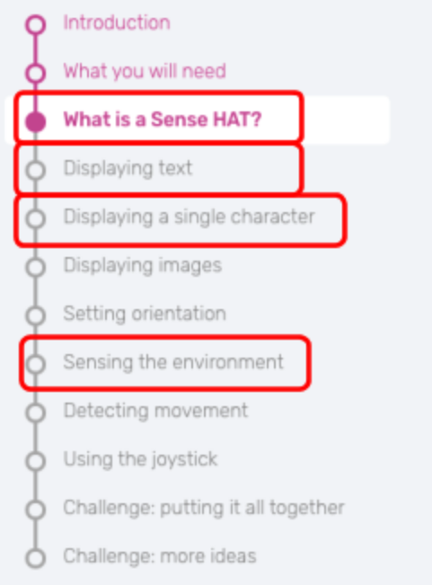

# Virtuel introduktion til Astro Pi
Der findes en online Astro Pi emulatior så man kan komme i gang uden selve Astro Pi computeren.

### Cheat sheet og dokumentation
Her er links til et hurtigt oversigtsdokument, cheat Sheet, og sensehat dokumentationen.
* [Cheat Sheet](http://www.tecoed.co.uk/uploads/1/4/2/4/14249012/sense_hat.pdf)
* [SenseHat referencer](https://pythonhosted.org/sense-hat/api/)

### Online introduktion
Den simpleste start er her:
[https://projects.raspberrypi.org/en/projects/getting-started-with-the-sense-hat](https://projects.raspberrypi.org/en/projects/getting-started-with-the-sense-hat)

Følgende afsnit giver en god indføring. Der er flere eksempler end man har tid og lyst til, men så må man udvælge.

### Mål
Målet med disse øvelser er at blive fortrolig med python syntaksen til at betjene vores Astro Pi.
Mere specifike skal I kunne
* Vise tekst og tal på senseHat displayet.
* Vise måledata på senseHat displayet.
* Skrive måledata på computerskærmen.
* Gemme måledata i fil, virtuelt med trinket.

På [https://trinket.io](https://trinket.io) kan man gemme sin kode og køre den virtuelt. De fleste elever brugte bare emulatoren på Astro Pi hjemmesiden, men trinket kan bruges til at dele eksempelkode mm.



### Opgave
Prøv at udforsk hvad senseHat modulet kan, fokuser på de afsnit i røde bokse.

## Gemme data virtuelt
Det er selvfølgeligt vigtigt at kunne gemme sin data. Det er heldigvis ikke så svært.

Den simpleste, AstroPiSimelGemData
```
with open ('gemData.csv', 'w') as file:
  file.write('gem denne streng')
  file.close
```
Denne kodestump danner en csv fil og genner den.
with open har
“w” - write,
“a” - append,
“r” - read
Settings, hvor man overskriver med write, tilføjer med append og læser med read.

### Opgave
* Kør programmet.
* Lav den om til append og gem det samme en masse gange (kør programmet igen og igen).
* Gem ```gem denne streng \n``` i stedet for, hvad er forskellen? (n er new line).
* Som diskuteret i afsnittet dataformater kan I også gemme værdier, på samme måde som i printer. Implementer ```file.write('Pi er ca {}\n'.format(3.14157))``` .
* Gamme data som cvs kolonner
* Hvis vi skal importere data i regneark og lignende er standarden at gemme som kommasepareret fil.  Det kan jo godt give problemer for os da vi bruger komme til noget andet og hvis I får problemer med det så brug ; i stedet.

Et lidt større eksempel [gemDataKolonner.py](/pythonFiler/gemDataKolonner.py)
```
import datetime
from time import sleep
from sense_hat import SenseHat
sense = SenseHat()


start_time = datetime.datetime.now()
now_time = datetime.datetime.now()
duration = datetime.timedelta(seconds=20)

with open ("test.csv", "w") as file:
    file.write("time , Temperature , pressure \n")

while now_time < start_time + duration:
    t = sense.get_temperature()
    p = sense.get_pressure()
    now_time= datetime.datetime.now()

    with open ("test.csv", "a") as file:
        file.write("%s, %s, %s  \n" % (now_time, t,p))
    sleep(1)
```
Programmet gemmer filen test.csv med overskrifterne time, Temperature, pressure. Variablene bliver aflæst i et loop på 20 sekunder og skrives på hver ny linje i linje 20. \n giver ny linje.

### Opgave
* Kør koden og kopier cvs filen over i et regneark og lav en kurve.
* Forklar forskellen på linjerne ```with open ("test.csv", "w") as file:```
 og  ```with open ("test.csv", "a") as file:```  i programmet.
* Tilføj en måling af fugtigheden med ```h = sense.get_humidity()``` og gem den ved at ændre på næstnederste linje.

Variablen ```i = 0``` bruges til at tælle med. Hvis I indsætter i = i + 1  i while løkken under variablen now_time, bliver i en større hver gang programmet kommer forbi den kodedel.

### Opgave
* Lav en variabel som tæller op og gem den.

Måden vi laver gentagne målinger er ved at bruge en løkke eller et loop. Her bruger vi et while  loop som tjekker om betingelsen ```now_time < start_time + duration``` og køre den indrykkede kodedel igen og igen indtil betingelsen ikke længere er opfyldt. Her er det variablen now_time som bliver opdateret og loopet kører indtil tiden er gået.

Her er en simpel implementering af et while loop.
```
from time import sleep
i = 0
while i < 20:
  print(i)
  i = i + 1
  sleep(1)
```
### Opgave
* Beskriv i ord hvad de forskellige linjer gør.
* Lav om i koden så ```i = i + 2``` og beskriv hvad der sker.

Tiden bliver styret af biblioteket datetime. Vi kan finde antallet af sekunder siden starten ved at beregne forskelle ```interval = now_time - start_time```.
Hvis vi vil have det i sekunder kan vi bruge ```interval.total_seconds()```.

### Opgave
* Lav om i filen, [gemDataKolonner.py](/pythonFiler/gemDataKolonner.py),  så det er tiden som er gået i sekunder vi gemmer.
